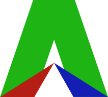

<!--

  

 -->

Act Engine, it's a simple, lightweight, code-first engine that provides the basic features for making a game.

it is written in the modern C++17, with some parts written in C17 and there is nothing extra to install 

(with exception of CMake to compile the engine)

it's licensed under the Boost Software License (BSL), which is very permissive

## WHY DOING A ENGINE
sometimes you may not find what you want in some generic engine, which tries to be
useful for all the cases

I decided to make a engine, mostly because I like coding,
and I tought that I could make my own engine
 
# IMAGE SUPPORT
 - **PNG**
 - **JPEG**
 - **TGA**

# AUDIO SUPPORT
  - **WAV**
  - **OGG**

# FONT SUPPORT
  - **TTF**
